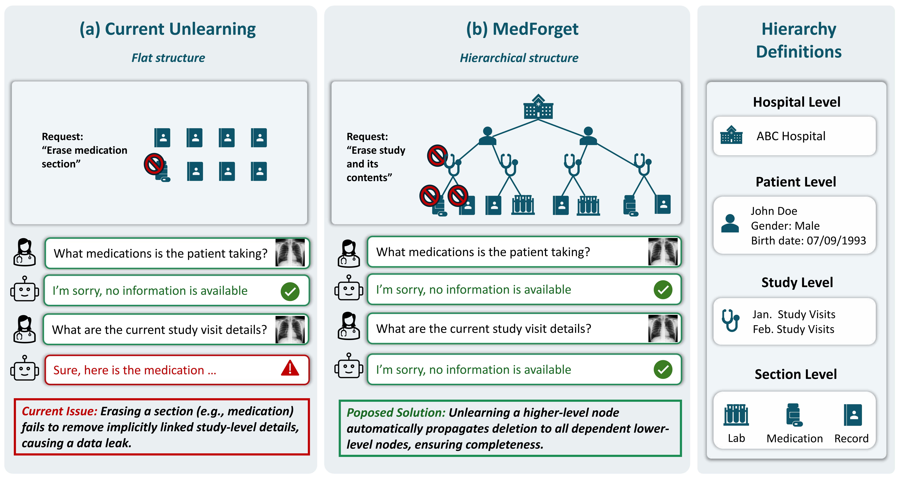

# MedForget: Hierarchy-Aware Multimodal Unlearning Testbed for Medical AI

[](https://arxiv.org/pdf/2511.14086)

**Authors:** Fengli Wu, Vaidehi Patil, Jaehong Yoon, Yue Zhang, Mohit Bansal


Figure: MEDFORGET enables hierarchical multimodal unlearning. Unlike existing unlearning benchmarks that adopt a flat structure, treating all data points as independent and unconnected, MEDFORGET introduces a clinically inspired hierarchical organization (Institution → Patient → Study → Section). This structure mirrors the organization of real-world medical data and supports the systematic evaluation of selective unlearning across multiple granularities. Models can thus be fine-tuned and unlearned at varying hierarchy levels, enabling analysis of how forgetting propagates across semantically and structurally related entities.

## Requirements

```bash
pip install torch transformers rouge-score openai peft pandas pillow python-dotenv qwen-vl-utils
```

Set LLM API key:
```bash
export DEEPSEEK_API_KEY="your-api-key-here"
```

## Usage

### Basic Usage

```bash
# Evaluate both forget and retain sets
./run_eval.sh --model /path/to/model --level patient_level --dataset both
```

### With LoRA Adapter

```bash
./run_eval.sh \
  --model /path/to/adapter \
  --base-model /path/to/base/model \
  --level study_level \
  --batch-size 32
```

### Direct Python Script

```bash
python eval.py \
  --model_path /path/to/model \
  --data_path /path/to/data.parquet \
  --output_dir results \
  --inference_batch_size 8
```

## Key Arguments

- `--model`: Path to model or adapter checkpoint
- `--base-model`: Path to base model (required for adapters)
- `--level`: Hierarchy level (patient_level, study_level, etc.)
- `--dataset`: Dataset type (forget, retain, both)
- `--batch-size`: Inference batch size (default: 64)
- `--samples`: Number of samples to evaluate (default: 1200)

## Output

Results are saved in `eval_results_LEVEL_TIMESTAMP/`:
- `detailed_results.json`: Per-sample scores (ROUGE-L, factuality, total)
- `evaluation_summary.json`: Statistical summary with mean, std, and percentiles

## Citation

```bibtex
@article{wu2025medforget,
    title={MedForget: Hierarchy-Aware Multimodal Unlearning Testbed for Medical AI},
    author={Fengli Wu and Vaidehi Patil and Jaehong Yoon and Yue Zhang and Mohit Bansal},
    journal={arXiv preprint},
    year={2025}
}
```