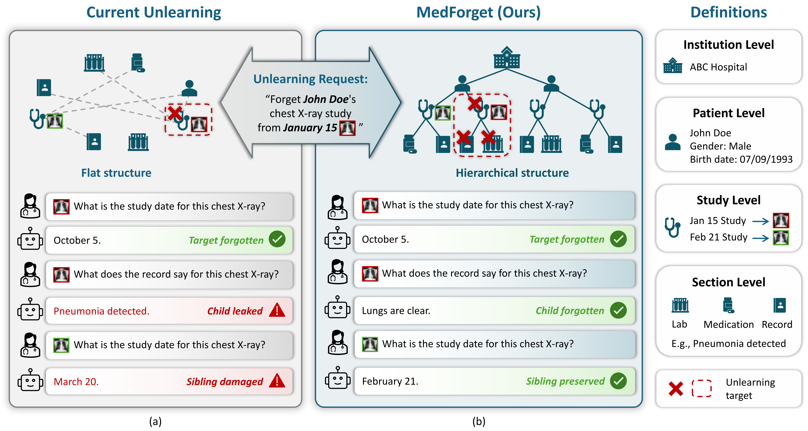
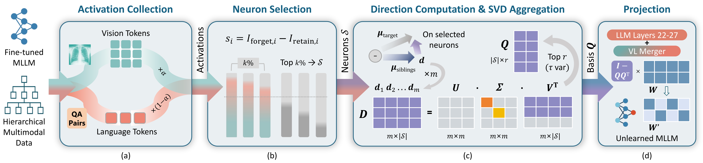

# Hierarchy-Aware Multimodal Unlearning for Medical AI

[](http://arxiv.org/abs/2512.09867)

## Authors
Fengli Wu, Vaidehi Patil, Jaehong Yoon, Yue Zhang, Mohit Bansal

## Overview

Pretrained Multimodal Large Language Models (MLLMs) are increasingly used in sensitive domains such as medical AI, where privacy regulations like HIPAA and GDPR require specific removal of individuals' or institutions' data. This motivates machine unlearning, which aims to remove the influence of target data from a trained model. However, existing unlearning benchmarks fail to reflect the hierarchical and multimodal structure of real-world medical data, limiting their ability to properly evaluate unlearning in practice. Therefore, we introduce **MedForget**, a hierarchy-aware multimodal unlearning benchmark that models hospital data as a nested structure, enabling fine-grained evaluation of multimodal unlearning across retain and forget splits.



Experiments with current unlearning methods show that existing approaches struggle to achieve effective hierarchy-aware forgetting without degrading downstream medical utility. To address this limitation, we propose **C**ross-modal **H**ierarchy-**I**nformed **P**rojection for unlearning (**CHIP**), a training-free, hierarchy-aware multimodal unlearning method that deletes information by selectively removing target-specific weight subspaces while preserving sibling-shared information. Experiments show that CHIP achieves the highest forget-retain performance gap across all hierarchy levels while maintaining competitive downstream utility compared to existing methods.



## Requirements

```bash
pip install torch transformers rouge-score openai peft pandas pillow python-dotenv qwen-vl-utils
```

Set LLM API key (for factuality evaluation):
```bash
export DEEPSEEK_API_KEY="your-api-key-here"
```

## Data

The MedForget benchmark is built on [MIMIC-CXR](https://physionet.org/content/mimic-cxr/2.0.0/). The dataset and fine-tuned model checkpoint will be released on PhysioNet soon. Stay tuned!

## Fine-tuning

We fine-tune [Lingshu-7B](https://huggingface.co/lingshu-medical-mllm/Lingshu-7B) (a Qwen2.5-VL based medical MLLM) on the MedForget training set using LoRA. 

### Quick Start

```bash
python finetune.py \
    --model_id lingshu-medical-mllm/Lingshu-7B \
    --data_dir /path/to/training_data.parquet \
    --save_dir /path/to/save_dir \
    --batch_size 4 \
    --num_epochs 10 \
    --lr 1e-4 \
    --gradient_accumulation_steps 4
```

Training automatically resumes from the latest checkpoint if interrupted.

### Fine-tuning Hyperparameters

| Parameter | Flag | Default | Description |
|-----------|------|---------|-------------|
| Batch size | `--batch_size` | 2 | Per-device batch size |
| Epochs | `--num_epochs` | 3 | Number of training epochs |
| Learning rate | `--lr` | 1e-4 | Learning rate |
| Accum. steps | `--gradient_accumulation_steps` | 4 | Gradient accumulation steps |
| LoRA rank | `--lora_r` | 16 | LoRA rank |
| LoRA alpha | `--lora_alpha` | 16 | LoRA scaling factor |
| LoRA dropout | `--lora_dropout` | 0.05 | LoRA dropout |
| Include merger | `--include_merger` | False | Include VL merger/projector in LoRA |
| Grad. ckpt. | `--no_gradient_checkpointing` | False | Disable gradient checkpointing |

## CHIP: Our Method

CHIP is a **training-free** unlearning method. It requires only forward passes to collect activations, then modifies model weights via orthogonal projection — no gradient updates needed.

### Quick Start

```bash
./run_chip.sh --model /path/to/finetuned_model --data /path/to/medforget_data --level institution_level
```

To run at other hierarchy levels:
```bash
./run_chip.sh -m /path/to/model -d /path/to/data -l patient_level
./run_chip.sh -m /path/to/model -d /path/to/data -l study_level
./run_chip.sh -m /path/to/model -d /path/to/data -l section_level
```

Or call the Python entry point directly:
```bash
python chip/chip.py \
    --model_id lingshu-medical-mllm/Lingshu-7B \
    --vanilla_dir /path/to/finetuned_model \
    --model_type Lingshu \
    --forget_file data/institution_level/forget_set_all.parquet \
    --retain_file data/institution_level/retain_set_all.parquet \
    --target_level institution \
    --save_dir ./chip_output
```

### CHIP Hyperparameters

| Parameter | Flag | Default | Description |
|-----------|------|---------|-------------|
| k | `--top-k` | 10 | Percentage of neurons to select |
| τ | `--variance` | 0.95 | SVD variance threshold for component selection |
| α | `--alpha` | 0.3 | Vision token weight in language layer activations (Eq. 1) |
| Layers | `--lang-layers` | 22-27 | Language layer indices for weight projection |
| Level | `--level` | institution | Hierarchy level: `institution`, `patient`, `study`, `section` |

## Evaluation

### Basic Usage

```bash
# Evaluate both forget and retain sets
./run_eval.sh --model /path/to/model --level patient_level --dataset both
```

### With LoRA Adapter

```bash
./run_eval.sh \
  --model /path/to/adapter \
  --base-model /path/to/base/model \
  --level study_level \
  --batch-size 32
```

### Direct Python Script

```bash
python eval.py \
  --model_path /path/to/model \
  --data_path /path/to/data.parquet \
  --output_dir results \
  --inference_batch_size 8
```

### Evaluation Arguments

| Argument | Description |
|----------|-------------|
| `--model` | Path to model or adapter checkpoint |
| `--base-model` | Path to base model (required for adapters) |
| `--level` | Hierarchy level (`patient_level`, `study_level`, etc.) |
| `--dataset` | Dataset type (`forget`, `retain`, `both`) |
| `--batch-size` | Inference batch size (default: 64) |
| `--samples` | Number of samples to evaluate (default: 1200) |

### Output

Results are saved in `eval_results_LEVEL_TIMESTAMP/`:
- `detailed_results.json`: Per-sample scores (ROUGE-L, factuality, total)
- `evaluation_summary.json`: Statistical summary with mean, std, and percentiles

## Citation

```bibtex
@article{wu2025medforget,
    title={Hierarchy-Aware Multimodal Unlearning for Medical AI},
    author={Fengli Wu and Vaidehi Patil and Jaehong Yoon and Yue Zhang and Mohit Bansal},
    journal={arXiv preprint arXiv:2512.09867},
    year={2025},
    url={https://arxiv.org/abs/2512.09867}
}
```
